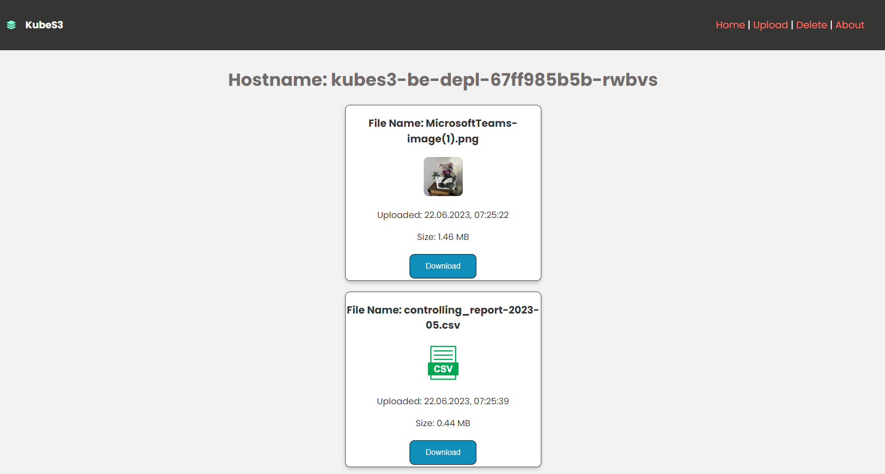
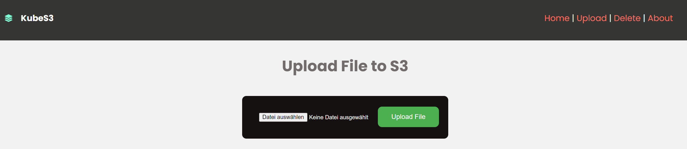

# DevOps - Basics and not-so Basics
This is an comprehensive project including some of the technologies used in software
engineering and DevOps.  
It is based on my personal knowledge which I acquired by myself over time and learned from different projects.  
The intention is to create a similar project in a workshop to get the attendees started with DevOps and SE. 



For interacting with the Objects I implemented different ways. Instead of using multiple Buttons, I played around with Forms and FormData.  
This is of course not the most efficient way ;)




## Topics
- RestAPI  
- Cloud-native  
- Object-oriented-programming (OOP)  
- Git  
- CI/CD  
- Docker / Containerization  
- SPA  
- Microservices  
- Kubernetes  
- ReactJS  
- Python  
- Node.js  
- npm / npx / pip  
- JSON / YAML  
- Reverse Proxy  
- ...

## The App
Cloud-native Fullstack-App for interacting with data from and to S3 storage via RestAPI and SPA. Written in Microservice-Architecture.  
Uses ReactJS in the Frontend, Python with FastAPI in the Backend and MinIO for S3 Storage.  

## How to run

### Run MinIO Container
```docker run -d -p 9000:9000 -p 9001:9001 -v my_s3_data:/data bitnami/minio:latest```  
If you dont pass ENVs the default user is **minio** and Password is **miniosecret**.

### Dev-Environment with Docker-compose
```
docker-compose up -d
docker-compose build --no-cache
```

### Deploy to Kubernetes
```kubectl apply -f k8s_stack.yaml```