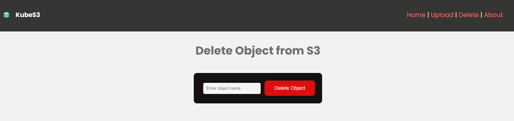
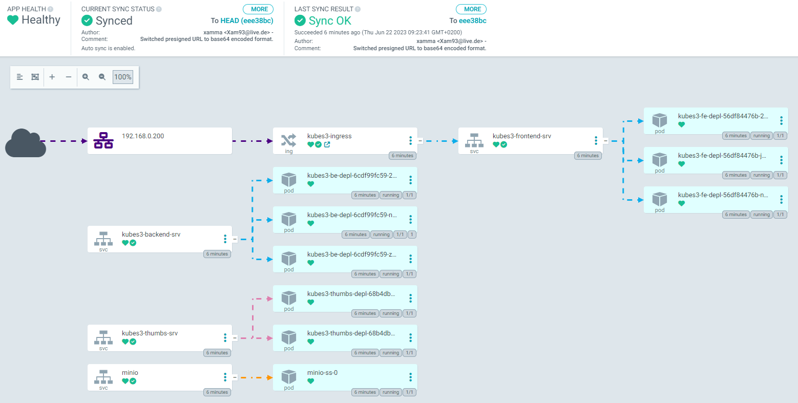

# KubeS3

[](https://github.com/xamma/KubeS3/actions/workflows/docker-image.yml)

This is an comprehensive project including some of the technologies used in software
engineering and DevOps.  
It is based on my personal knowledge which I acquired by myself over time and learned from different projects.  
The intention is to create a similar project in a workshop to get the attendees started with DevOps and SE. 


For interacting with the Objects I implemented different ways. Instead of using multiple Buttons, I played around with Forms and FormData.  
This is of course not the most efficient way ;)




## Topics
- RestAPI  
- Cloud-native  
- Object-oriented-programming (OOP)  
- Git  
- CI/CD  
- Docker / Containerization  
- SPA  
- Microservices  
- Kubernetes  
- Helm  
- ReactJS  
- Python  
- Go  
- Node.js  
- npm / npx / pip  
- JSON / YAML  
- Reverse Proxy  
- TLS/SSL
- ...

## The App
Cloud-native Fullstack-App for interacting with data from and to S3 storage via RestAPI and SPA. Written in Microservice-Architecture.  
Uses ReactJS in the Frontend, Python with FastAPI in the Backend and MinIO for S3 Storage.  
Also includes an independent Microservice for creating Thumbnails, written in Go.  

## Pre-Requirements
Kubernetes-cluster with:
- StroageProvider (e.g. Longhorn / openEBS) installed & configured
- NGINX ingress controller installed
- cert-manager installed & configured

## How to run

### Run MinIO Container
```docker run -d -p 9000:9000 -p 9001:9001 -v my_s3_data:/data bitnami/minio:latest```  
If you dont pass ENVs the default user is **minio** and Password is **miniosecret**.

### Dev-Environment with Docker-compose
```
docker-compose build --no-cache
docker-compose up -d
```
***not up-to-date**

### Deploy to Kubernetes

```kubectl apply -f k8s-manifests```  

I reworked the K8s-manifests to not be all in one file, but to be consolidated in the folder **k8s-manifests**.  
Also I changed the Pod and PVC combination for the minio-Data to an StatefulSet.  
Another change is to not pass the ConfigMap Key-by-Key instead use ***envFrom***.  
You can still use the old stack: ```kubectl apply -f k8s_stack-old.yaml```  

*OUTDATED*  
*********************************
**Important**: The newest Stack uses ***OpenEBS*** as storage provider and thus needs to be installed on the K8s-Cluster the application is deployed to.  
```
helm repo add openebs https://openebs.github.io/charts
helm repo update
helm install openebs --namespace openebs openebs/openebs --create-namespace
```

Also make sure nginx ingress controller is installed:  
```
helm repo add ingress-nginx https://kubernetes.github.io/ingress-nginx
helm repo update
helm install nginx-ingress ingress-nginx/ingress-nginx -n nginx-ingress --create-namespace
```
*********************************

### Helm
I also added this App in my helm-charts, which can be found on **https://xamma.github.io/helm-charts**.  

To use the App on your K8s-Cluster, you need to have ***open-ebs*** and ***nginx-ingress*** installed.  
```
helm repo add xammahelm https://xamma.github.io/helm-charts
helm repo update
helm search repo xammahelm
helm install kubes3-release xammahelm/kubes3 -n NAMESPACE --create-namespace
helm install kubes3-release xammahelm/kubes3 --set key=value --namespace my-namespace
helm uninstall my-webapp -n my-namespace
helm repo remove REPONAME
```

### CI/CD and GitOps
I tried to use best-practices regarding CI/CD and GitOps.  
My CI pipeline is realized with **GithubActions** which build my Frontend- and Backend-ContainerImages and pushes them to the GHCR.  
The CD part is taken care of from **ArgoCD** (running on K8s) which lets me deploy the Application directly to Kubernetes and keeps
it up-to-date and synced based on new commits.  
You can also deploy from the Helm-Chart here.  

